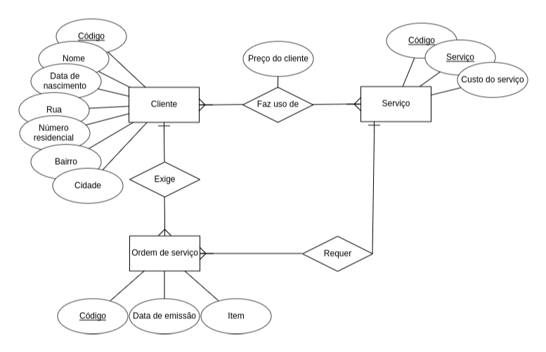
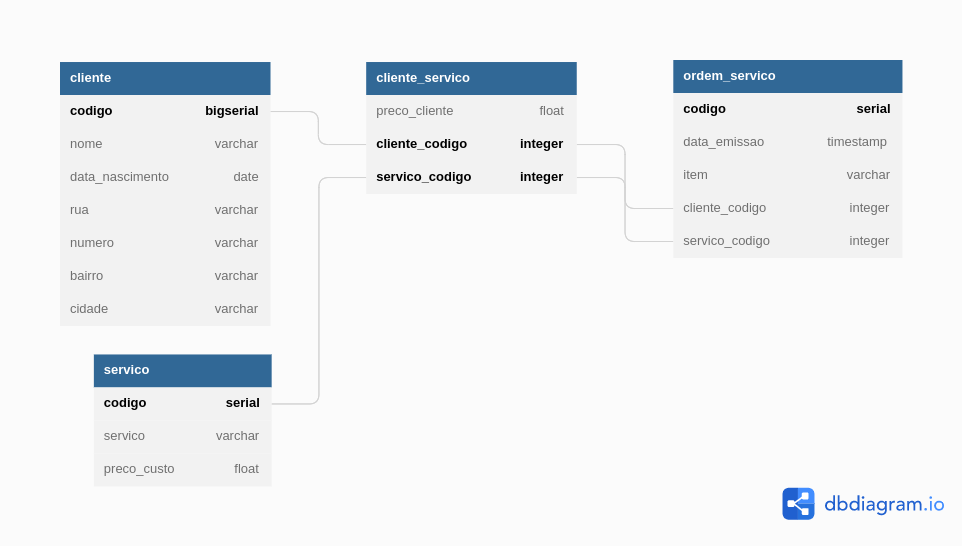

# gerador-aleatorio-sql-ts

## Sumário

- [gerador-aleatorio-sql-ts](#gerador-aleatorio-sql-ts)
  - [Sumário](#sumário)
  - [Motivação](#motivação)
  - [Pilha de tecnologia](#pilha-de-tecnologia)
  - [Galeria](#galeria)
  - [Como rodar](#como-rodar)
    - [Pré-requisitos](#pré-requisitos)
    - [Passo a passo](#passo-a-passo)

## Motivação

Este repositório de código foi criado para facilitar uma atividade da unidade curricular Banco de Dados II que consistia em popular o banco de dados de teste da atividade em questão e consultar informações especificadas pelo professor.

Foi utilizada a biblioteca [Faker](https://fakerjs.dev/), a qual gera valores aleatórios (e falsos), como nomes masculinos/femininos e endereços residenciais; e tem suporte para outros idiomas além do inglês estadunidense, como o português brasileiro. O app utiliza tal biblioteca para criar quatro arquivos SQL no diretório [`sql/`](./sql/), cujos conteúdos compuseram o código-fonte da atividade em questão, [`script.sql`](./script.sql). Tendo isso em vista, o código-fonte principal, [`index.ts`](./index.ts), foi personalizado para indentar e formatar os arquivos SQL, o que explica as funções `tab` e `computaApostrofe`. Vale destacar que o presente repositório não foi avaliado pelo professor, apenas o arquivo [`script.sql`](./script.sql). Portanto, o código-fonte não está organizado em subdiretórios e todas as funções estão no código-fonte principal.

Este foi o primeiro repositório de código apresentado no [Curso Superior de TSI do IFMS](https://www.ifms.edu.br/campi/campus-aquidauana/cursos/graduacao/sistemas-para-internet/sistemas-para-internet) como requisito para obtenção da nota parcial das atividades da unidade curricular Banco de Dados II.

## Pilha de tecnologia

As seguintes tecnologias foram utilizadas para desenvolver este app:

| Papel | Tecnologia |
|-|-|
| Ambiente de execução | [Node](https://nodejs.org/en/) |
| Linguagem de programação | [TypeScript](https://www.typescriptlang.org/) |
| Linguagem de consulta | [PostgreSQL](https://www.postgresql.org/) |
| RNG | [Faker](https://fakerjs.dev/) |

## Galeria




## Como rodar

### Pré-requisitos

- [Node](https://nodejs.org/en/download/);
- [Yarn](https://yarnpkg.com/) (opcional).

### Passo a passo

1. Clone o repositório de código em sua máquina;
   
2. Abra um shell de comando de sua preferência (prompt de comando, PowerShell, terminal _etc_.);

3. Instale as dependências do projeto através do seguinte comando:

```console
$ npm install
```

Caso esteja utilizando o gerenciador de pacotes Yarn, execute o seguinte comando como alternativa:

```console
$ yarn
```

4. Finalmente, execute o seguinte comando para iniciar o app:

Para npm:

```console
$ npm run dev
```

Para Yarn:

```console
$ yarn dev
```

Note que você pode customizar o código-fonte [`index.ts`](./index.ts), modificando o número de nomes/endereços gerados aleatoriamente.